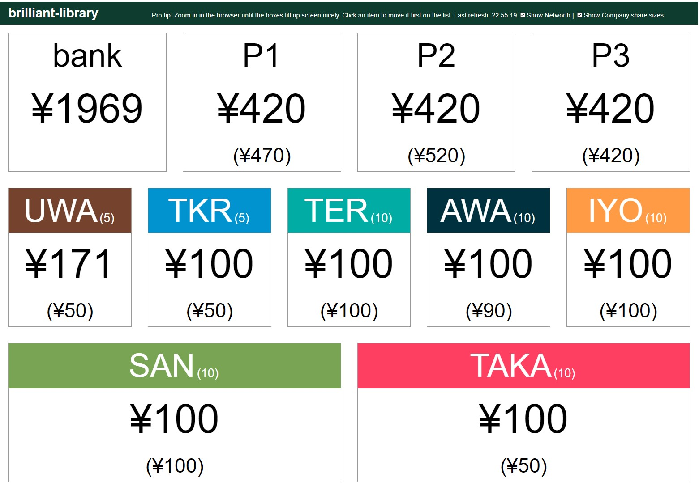

# 18SH Cash Display - cristopulos Fork

This is a forked version of msaari [18sh Cash Display](https://github.com/msaari/18sh-display) that is compatible with the [forked version](https://github.com/cristopulos/18sh) of [18SH](https://github.com/msaari/18sh). This fork is NOT compatible with the original 18SH. This version allows you to also display players networth, company share value and company share size (for 18xx games with variable company sizes)

18SH Cash Display is a web server that receives updates from 18SH and has a simple web interface that shows the status. It is very low on features on purpose and for example has very thin security features. The purpose is to run it on a temporary server during the game and then run down the server, so security is not much of an issue.

## Installing

Clone the project and install the dependencies:

	git clone https://github.com/cristopulos/18sh-display.git
	cd 18sh-display
	npm install

## Running the server online

Easiest solution to get a server live is to use a service like [Adaptable](https://adaptable.io). As Adaptable requires the app to be linked with github repo you will probably need to create your own "fork" to set it up, but after that it should be as easy as linking your public repo, chosing an app name and waiting for an app to deploy. 

This should get you a running server, with a name like `https://your_app_name.adaptable.app`. You can navigate to `/18sh` on the server to make sure it works; that should get you a menu page with a list of games currently running at the server. To use this with 18SH, you need to set up an environmental variable that points to the running server. The exact method depends on your system ([see this helpful guide](https://www.schrodinger.com/kb/1842)). In Windows PowerShell this should look like this:

	$Env:DISPLAY18SH="https://your_app_name.adaptable.app/18sh/"

In any case, the name of the environmental variable is `DISPLAY18SH` and you need to add `18sh/` to the end of the URL from Heroku (or wherever it is you host the server). This variable needs to be set on the system you use to run 18SH, not on the system that runs the Cash Display.

## Running on localhost

You can also run the server on localhost. If you have a big screen, you can fit both the cash display and the terminal on the same screen. Even better is if you have multiple screens. You can also access the localhost server from another device in the same network.

To start the server, use

	NODE_ENV=production node index.js

It's normal that there's no response at all. Now the server is running on port 3000 on localhost. You can then use

	export DISPLAY18SH=http://localhost:3000/18sh/

to connect 18SH to the server running on the same computer. If you want to connect from another computer in the same network, replace `localhost` with the local IP of the computer (something like `192.168.1.1` or so).

## Compatibility with 18SH

If you use the latest version of both 18SH and the Cash Display, you'll be fine. If you want to use released versions, make sure both 18SH and the Cash Display have the same major version number (major version is the first number in the version number), and there should be no compatibility issues.

## Use during play

When you have the environmental variable set up and the server running, there's nothing else to do. 18SH will pick up the variable and will update the server with the new cash status after every move. All that remains is to point your browser to the server:

	https://your_app_name.adaptable.app/18sh/<gamename>

where `<gamename>` is the name of your game in 18SH. This should bring up the cash display. The display will refresh automatically every couple of seconds.

### Adjusting the order of companies

If you want to adjust the order of companies and players on the display, you can move a company to the top of the list by clicking it. This can be helpful for example when each player is using their own device to watch the display. Each player can then have their own display show their own cash and their own companies first.

## Company colors

The display can show colors for companies. The colors are set from [a CSS file](/css/style.js) (it's a JavaScript module, but inside it's just CSS). Each name tag, company or player, will get a CSS class based on the name: it's the name with all non-alphanumeric characters replaced with underscores.

These classes can be used to set up colors for companies. The CSS file has some familiar companies already set up (18xx staples like PRR, B&O, C&O, NYC and Erie), and you can add more to suit your needs (if you do add more companies, please do a pull request so I can add them in).

## Example

## Dependencies

18SH Cash Display is built from a fairly small set of bricks.

- The server uses [Koa](https://koajs.com/), which is a small, expressive and robust web framework for node.js.
- It is augmented with [koa-bodyparser](https://github.com/koajs/bodyparser) and [koa-router](https://github.com/ZijianHe/koa-router).
- Data storage is done with [conf](https://github.com/sindresorhus/conf).

## License

Copyright 2020 [Mikko Saari](https://github.com/msaari/) mikko@mikkosaari.fi

See [license information](LICENSE).
